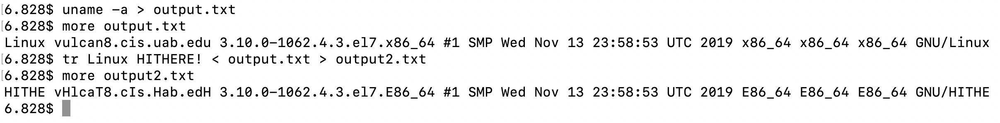

# CS433-HW2

## Project Discription:
An extention of a skelaton shell to impliment piping and I/O redirect.

## Author:
Andrew Bertella
berba@uab.edu

## Getting Started:
Dependencies:
    This software requires a gcc compiler and the C standard library to compile and link. Additionally, make will ease the build process.

Instructions for Building:
    This program can be built easily with the included Makefile. Just navigate to the source directory and run make.
    
## Testing:
    The functionality of this program was tested using the Vulcan on moat. Each method was tested and performed properly. Additionaly, Valgrind was used to detect memory leaks. This program performed as expected in these test cases. I/O redirect, piping and basic fork/exec performed as expected
    Additional test cases can be executed by building the program and executing it with various commands and various directories.

## Screenshots/Sample Session:

## Contact info
Andrew Bertella
berba@uab.edu
