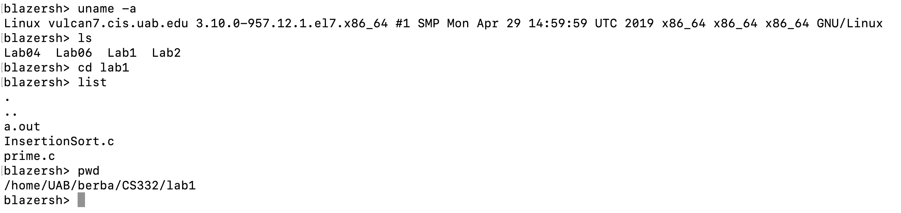
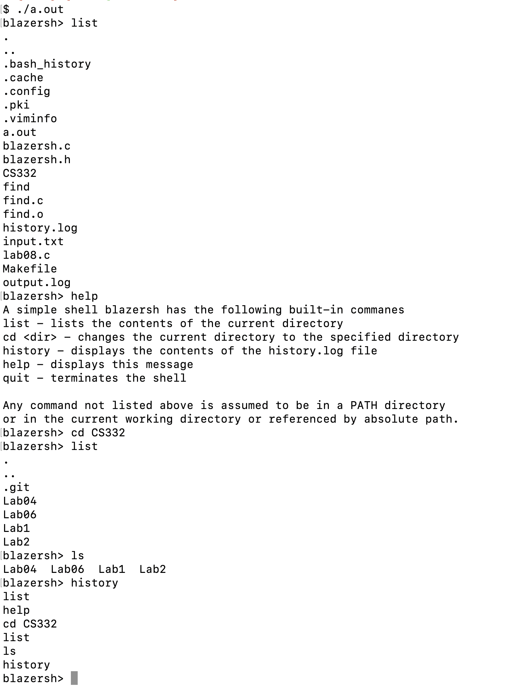

# CS332-Project02

## Project Discription:
This project impliments a minimal command interpretor blazersh that is able execute a handful of simple  built in commands and execute other programs.

## Author:
Andrew Bertella
berba@uab.edu

## Awknowlegment:
The Makefile is largely based off the sample Makefile from Lab06 and the signal handler is largely based on the example code in Lab09.

## Getting Started:
Dependencies:
    This software requires a gcc compiler and the C standard library to compile and link. Additionally, make will ease the build process.

Instructions for Building:
    This program can be built easily with the included Makefile. Just navigate to the source directory and run make.
    
## Testing:
    The functionality of this program was tested using the Vulcan on moat. Each method was tested and performed properly. Additionaly, Valgrind was used to detect memory leaks. This program performed as expected in these test cases. Simple normal shell operations like hostname, uname -a, ls and ps were used to asertain the proper functionality of the execvp function. All these cases performed as expected. To test the signal handler, the hw1.c program and ps commad was used to guarentee that the CTRL-Z and CTRL-C apporpiatly acted on the child process.
    Additional test cases can be executed by building the program and executing it with various commands and various directories.

## Screenshots/Sample Session:

## Contact info
Andrew Bertella
berba@uab.edu
